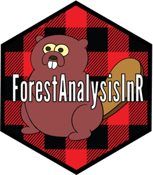

<!-- README.md is generated from README.Rmd. Please edit that file -->

```{r, include = FALSE}
knitr::opts_chunk$set(
  collapse = TRUE,
  comment = "#>",
  fig.path = "man/figures/README-",
  out.width = "100%"
)
```

# ForestAnalysisInR

<!-- badges: start -->
<!-- badges: end -->

ForestAnalysisInR is a "metapackage," an R package that is meant to help users find the right tools in R to produce the analysis they need.



## Installation

You can install the development version of ForestAnalysisIn from [GitHub](https://github.com/) with: 
```{r install, eval = FALSE}
devtools::install_github("atkinsjeff/ForestAnalysisInR")

library("ForestAnalysisInR")

```

## Example

At the core of ForestAnalysisIn is a `Shiny` app which gives produces a sortable and querable data table
of all the availble R packages for forestry and forest ecology research:

```{r example, eval = FALSE}
library(ForestAnalysisInR)
## basic example code
launchRFA()
```

